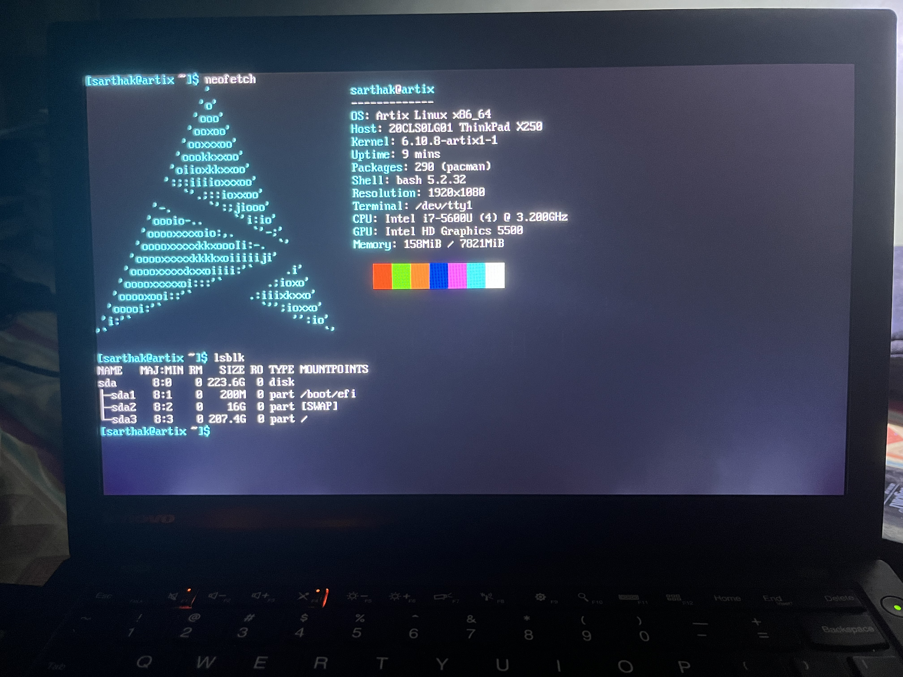

# Artix-OpenRC + Hyprland
Installation guide and config files for my artix-openrc + hyprland setup, for posterity's sake and in case I fuck up. As it turns out, I did fuck up quite a few times attempting to dual boot my existing install with [FreeBSD](https://www.freebsd.org/) + [Windowmaker](https://www.windowmaker.org/), and learned a couple of things the hard way:

1. Always install BSD first. BSD's swap system can and will interfere with Linux's, and besides, you don't have to manually configure grub post-install because Linux's grub will detect the existing BSD install anyway.
2. BSD is hard, and wildly different from Linux. There are no ```sudo``` privileges for you, you spoilt brat.

So naturally, I dropped the idea (rather, shelved it for some other day).

# Introduction
This setup was installed on my Thinkpad X250 with Intel i7-5600U (4 cores @ 3.2 GHz) and Intel HD Graphics 5500, 8GB RAM and 256GB SSD.

Like every other Linux installation (unless you are a Gentoo guy) the process begins with visiting the [official website](https://artixlinux.org/download.php) and downloading the image file of your choice. In my case, it was ``artix-base-openrc-20240823-x86_64.iso``. The reason for choosing an Arch-based distro was that I wanted a minimal setup that I could customize to my heart's content and that would do justice to this dated hardware. I did try out Ubuntu server a long time ago as Debian-based distros are my cup of tea, but had no luck with it. The reason for going with the base install of Artix was that ``openrc`` as an init-system (the first process started during booting of an OS, and the last process to terminate before shutdown) is more lightweight and fast as compared to Arch's ``systemd`` - which has its [fair share of criticisms](https://www.youtube.com/watch?v=o_AIw9bGogo).

<div align="center">
  <a href="https://www.youtube.com/watch?v=o_AIw9bGogo"></a>
</div>

The next logical step then is to create a bootable USB installer using any tool you get your hands on - Rufus and [balenaEtcher](https://etcher.balena.io/) are popular options. I used to be a balenaEtcher user, but have eventually shifted to [Ventoy](https://www.ventoy.net/en/index.html). Ventoy offers several advantages - first, it creates a multi-bootable USB (that is, you can flash several disk images of your choice in a single USB drive and boot into the one you want to install), and secondly, adding a new ISO (or removing an existing one!) to the mix is as easy as copying (or deleting) it into the USB drive. No need for re-doing the process over and over again.

Anyway, then you boot into the system by accessing the boot menu in the BIOS - in my case, I had to press the F12 key, select my USB drive as the boot option, and then select the Artix ISO to boot into. Make sure to have secure boot option disabled, and UEFI mode enabled. Once you're inside the live system, the real fun begins. Login as the root - the default password is 'artix'. If the font is too small to be legible, the size can be doubled by using the command

```bash
setfont -d
```

This can be undone by a simple

```bash
setfont
```

With that out of the way, let's get into the nitty-gritty of the installation process. In the rest of the tutorial, for the most part, I use the terms 'I' and 'my' - this is because these steps were jotted down more as a journal to self than for the purpose of dissemination, but here we are.

# Installation of Artix

## [Connecting to the Internet](tutorials/install_1.md)

## [Partitioning the Disk](tutorials/install_2.md)

## [Installing the System](tutorials/install_3.md)

## [Configuring the System](tutorials/install_4.md)

## Post-Installation

We are done with the installation, so as a duty-bound citizen of the Linux community, I can now execute the following commands:

```bash script
pacman -S neofetch
neofetch
lsblk
```

A screenshot where a screenshot is due:



As you can see, the system is taking up only 158MiB of RAM. This is the part where I gleefully say: I use Artix, btw.
